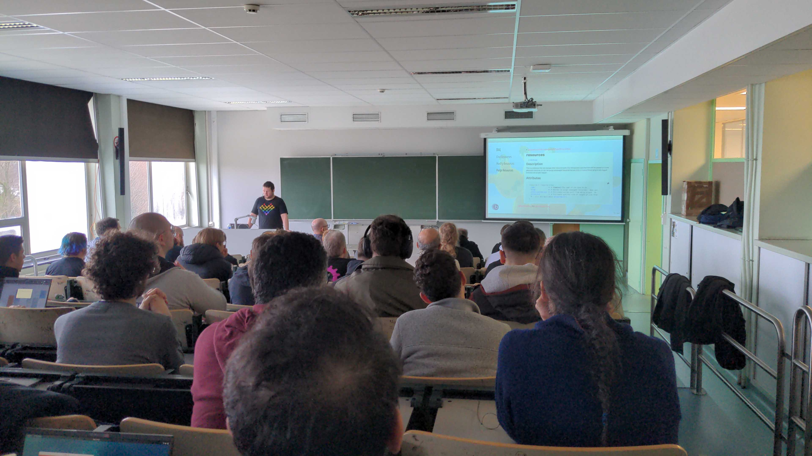
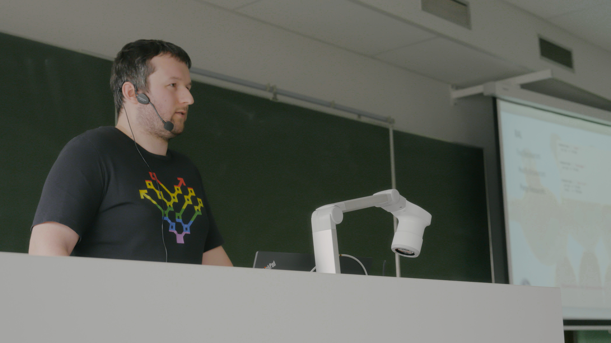

# Configuration Management Camp 2024

## Vox Pupuli - Community Update (ignate talk)

Vox Pupuli is a Puppet focused community. The goal is to unite lonely module and
tooling authors to provide a home for orphaned modules and to ensure a continued
development of the code base. In this ignite we will inform you about the state
of Vox Pupuli, our growth and that we accept funding now (and how you can sponsor
us)!

* Online Repo: [github.com/bastelfreak/cfgmgmtcamp2024](https://github.com/bastelfreak/cfgmgmtcamp2024?tab=readme-ov-file#vox-pupuli---community-update-ignate-talk)
* Schedule: [cfp.cfgmgmtcamp.org/2024/talk/7PJR78/](https://cfp.cfgmgmtcamp.org/2024/talk/7PJR78/)
* Online Slides: [bastelfreak.de/cfgmgmtcamp2024/ignite.html](https://bastelfreak.de/cfgmgmtcamp2024/ignite.html)
* PDF: [github.com/bastelfreak/cfgmgmtcamp2024/blob/main/Vox_Pupuli_-_Community_Update.pdf](https://github.com/bastelfreak/cfgmgmtcamp2024/blob/main/Vox_Pupuli_-_Community_Update.pdf)
* Recording: https://www.youtube.com/watch?v=yxZ8jf8qI6Q

## Puppet hacks you didn't know you were looking for

* Ever needed to debug a Puppet agent run but didn't find the right path?
* Tired of maintaing excel sheets with servers and service now is too expensive?
* Your puppetserver has a hiccup every 30 minutes? Or every week?
* You need to create clusters but manual firewall changes for every node are too time consuming?

This talk is for you! We will go through all the hidden gems of cli commands and
puppet concects you won't find in the documentation. And we will talk about
tuning and debugging your puppetserver(s)

* Online Repo: [github.com/bastelfreak/cfgmgmtcamp2024](https://github.com/bastelfreak/cfgmgmtcamp2024?tab=readme-ov-file#puppet-hacks-you-didnt-know-you-were-looking-for)
* Schedule: [https://cfp.cfgmgmtcamp.org/2024/talk/BRBVJK/](https://cfp.cfgmgmtcamp.org/2024/talk/BRBVJK/)
* Online Slides: [bastelfreak.de/cfgmgmtcamp2024/hacks.html](https://bastelfreak.de/cfgmgmtcamp2024/hacks.html)
* PDF: [github.com/bastelfreak/cfgmgmtcamp2024/blob/main/Puppet_hacks_you_didn_t_know_you_were_looking_for.pdf](https://github.com/bastelfreak/cfgmgmtcamp2024/blob/main/Puppet_hacks_you_didn_t_know_you_were_looking_for.pdf)

## License & Infos

* This project contains two licenses. The code is licensed as [GNU Affero General Public License v3.0](LICENSE). The documentation/text is licsensed as [CC BY-NC-SA 4.0](LICENSE2).
* You can find more talks from bastelfreak in his [repository](https://github.com/bastelfreak/talks) (he is also available for Puppet consulting)

## Pictures

From David Swan during the 'Puppet hacks you didn't know you were looking for' talk

[cc-by 4.0](https://creativecommons.org/licenses/by/4.0/) licensed pictures from Jan Koppe

